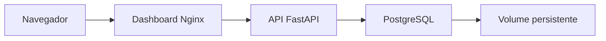

# Laboratório Docker e CI/CD

Projeto educacional desenvolvido para praticar Docker, Docker Compose, FastAPI, PostgreSQL, Nginx, testes automatizados e integração contínua com GitHub Actions.

A aplicação permite cadastrar, listar, consultar e excluir registros de estudos por meio de um dashboard web.

## Versão atual

```text
1.2.0
```

## Arquitetura



A aplicação possui três serviços:

| Serviço | Tecnologia | Responsabilidade |
|---|---|---|
| `dashboard` | Nginx, HTML, CSS e JavaScript | Interface web e proxy reverso |
| `api` | Python e FastAPI | Regras da aplicação e endpoints HTTP |
| `db` | PostgreSQL | Armazenamento dos registros |
| `postgres_data` | Volume Docker | Persistência dos dados |

## Funcionalidades

- Cadastro de registros de estudo;
- Listagem dos registros;
- Consulta por identificador;
- Exclusão de registros;
- Validação dos dados recebidos;
- Documentação automática da API;
- Healthchecks dos containers;
- Persistência com volume Docker;
- Proxy reverso com Nginx;
- Testes unitários e integrados;
- CI/CD com GitHub Actions;
- Publicação de imagens no GitHub Container Registry.

## Estrutura do projeto

```text
lab-docker-cicd/
├── .github/
│   └── workflows/
│       └── ci.yml
├── app/
│   ├── database.py
│   ├── main.py
│   ├── models.py
│   └── schemas.py
├── dashboard/
│   ├── app.js
│   ├── Dockerfile
│   ├── index.html
│   ├── nginx.conf
│   └── styles.css
├── scripts/
│   └── integration_check.py
├── tests/
│   ├── test_main.py
│   └── test_studies.py
├── .dockerignore
├── .env.example
├── .gitignore
├── compose.yml
├── Dockerfile
├── README.md
└── requirements.txt
```

## Pré-requisitos

Para executar o projeto, é necessário ter:

- Git;
- Docker Desktop;
- Docker Compose;
- Python 3.13, caso deseje executar os testes localmente.

## Clonar o projeto

```powershell
git clone https://github.com/ricsanol/lab-docker-cicd.git
cd lab-docker-cicd
```

## Configurar as variáveis de ambiente

Copie o arquivo de exemplo:

```powershell
Copy-Item .env.example .env
```

Abra `.env` e configure:

```dotenv
POSTGRES_DB=labdb
POSTGRES_USER=labuser
POSTGRES_PASSWORD=defina_uma_senha_local
DATABASE_URL=postgresql+psycopg://labuser:defina_uma_senha_local@db:5432/labdb
```

O arquivo `.env` não é enviado ao GitHub porque pode conter informações sensíveis.

## Iniciar a aplicação

Construa as imagens e inicie os containers:

```powershell
docker compose up -d --build
```

Acompanhe o estado dos serviços:

```powershell
docker compose ps
```

Os containers devem aparecer como `healthy`.

## Endereços

| Recurso | Endereço |
|---|---|
| Dashboard | http://127.0.0.1:8080 |
| API | http://127.0.0.1:8002 |
| Documentação Swagger | http://127.0.0.1:8002/docs |
| Healthcheck | http://127.0.0.1:8002/health |
| Versão | http://127.0.0.1:8002/version |

## Endpoints da API

| Método | Endpoint | Função |
|---|---|---|
| `GET` | `/` | Retorna informações da aplicação |
| `GET` | `/health` | Verifica a saúde da API |
| `GET` | `/version` | Retorna a versão atual |
| `POST` | `/studies` | Cria um estudo |
| `GET` | `/studies` | Lista os estudos |
| `GET` | `/studies/{id}` | Consulta um estudo |
| `DELETE` | `/studies/{id}` | Exclui um estudo |

### Exemplo de cadastro

```json
{
  "title": "Docker Compose",
  "description": "Estudo sobre aplicações com múltiplos containers."
}
```

## Executar os testes Python

Crie e ative um ambiente virtual:

```powershell
python -m venv .venv
.\.venv\Scripts\Activate.ps1
```

Instale as dependências:

```powershell
python -m pip install -r requirements.txt
```

Execute os testes:

```powershell
python -m pytest -v
```

Resultado esperado:

```text
9 passed
```

Os testes dos endpoints utilizam um banco SQLite temporário e não modificam o PostgreSQL do Docker Compose.

## Executar o teste integrado

Com os containers em execução:

```powershell
python .\scripts\integration_check.py
```

O teste integrado verifica:

1. A entrega do dashboard pelo Nginx;
2. O proxy entre Nginx e FastAPI;
3. O healthcheck da API;
4. A criação de um registro;
5. A consulta por ID;
6. A listagem;
7. A exclusão;
8. A resposta HTTP 404.

Resultado esperado:

```text
[SUCESSO] Teste integrado concluído.
```

## Persistência dos dados

O PostgreSQL utiliza o volume:

```text
lab-docker-cicd_postgres_data
```

Parar e remover os containers não remove os registros:

```powershell
docker compose down
docker compose up -d
```

Para remover também os dados do laboratório:

```powershell
docker compose down --volumes
```

Atenção: o segundo comando apaga definitivamente os dados armazenados no volume.

## Comandos úteis

Consultar logs:

```powershell
docker compose logs
```

Acompanhar os logs:

```powershell
docker compose logs --follow
```

Consultar apenas a API:

```powershell
docker compose logs api
```

Consultar apenas o PostgreSQL:

```powershell
docker compose logs db
```

Consultar apenas o dashboard:

```powershell
docker compose logs dashboard
```

Parar os serviços sem removê-los:

```powershell
docker compose stop
```

Iniciar novamente:

```powershell
docker compose start
```

Remover containers e rede, preservando o volume:

```powershell
docker compose down
```

Validar o arquivo Compose:

```powershell
docker compose config --quiet
```

Acessar o PostgreSQL:

```powershell
docker compose exec db psql -U labuser -d labdb
```

## CI/CD

O GitHub Actions executa automaticamente:

1. Validação do `compose.yml`;
2. Instalação das dependências Python;
3. Testes automatizados;
4. Build da imagem da API;
5. Build da imagem do dashboard;
6. Validação do Nginx;
7. Inicialização dos três containers;
8. Teste integrado;
9. Publicação das imagens após aprovação na `main`.

Pull Requests são testados, mas não publicam imagens.

## Imagens Docker

API:

```text
ghcr.io/ricsanol/lab-docker-cicd
```

Dashboard:

```text
ghcr.io/ricsanol/lab-docker-cicd-dashboard
```

As imagens podem receber duas tags:

- `latest`: versão mais recente;
- SHA do commit: versão exata e rastreável.

## Tecnologias utilizadas

- Python 3.13;
- FastAPI;
- SQLAlchemy;
- Psycopg;
- PostgreSQL 17;
- HTML;
- CSS;
- JavaScript;
- Nginx;
- Docker;
- Docker Compose;
- Pytest;
- Git;
- GitHub Actions;
- GitHub Container Registry.

## Objetivo educacional

Este laboratório demonstra como separar os componentes de uma aplicação em containers independentes, conectá-los por uma rede interna, preservar dados em volumes e automatizar testes e builds.

A estrutura serve como preparação para containerizar sistemas maiores com API, banco de dados e dashboard separados.

## Autor

Ricardo Oliveira

GitHub: [ricsanol](https://github.com/ricsanol)